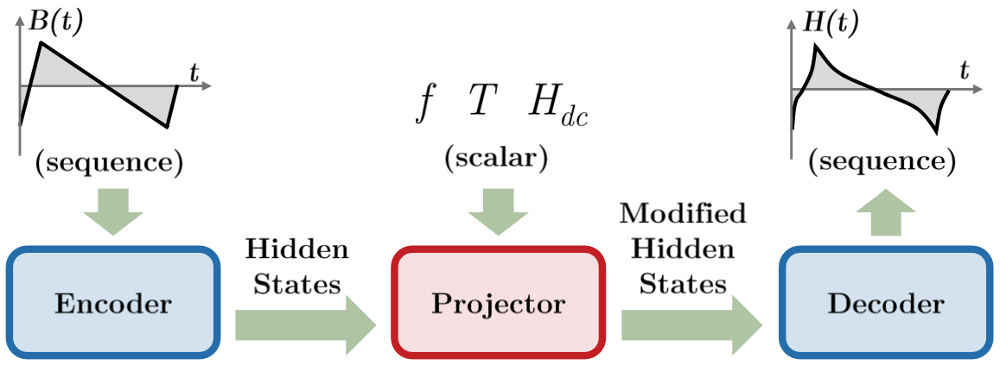

## Tutorial

This is a brief tutorial of how to train and test a transformer-based encoder-projector-decoder neural network model for the hysteresis loop prediction of power magnetics.

The main tutorial can be found in the Jupyter notebook `Transformer_Tutorial.ipynb`, where a simple network model is trained for the sinusoidal waveform predictions. The model is trained based on the dataset `Dataset_sine.json`. The trained model is saved as state dictionary file `Model_Transformer.sd`, and the testing results and their references are saved in `pred.csv` and `meas.csv`.

Two sub-tutorials, `Demo_Train.ipynb` and `Demo_Test.ipynb`, are also provided, separately demonstrating the training part and the testing part of the network model.

To simplify the learning process and get a quick start, we suggest downloading the notebook file and executing it step-by-step in the [Google Golab](https://colab.research.google.com/) (free).

